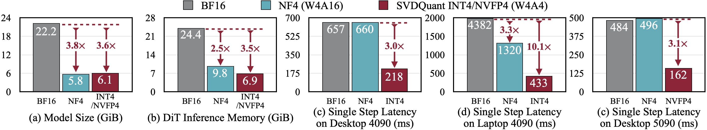

# Nunchaku

Nunchaku is an inference engine designed for 4-bit diffusion models, as demonstrated in our paper [SVDQuant](http://arxiv.org/abs/2411.05007). Please check [DeepCompressor](https://github.com/mit-han-lab/deepcompressor) for the quantization library.

### [Paper](http://arxiv.org/abs/2411.05007) | [Project](https://hanlab.mit.edu/projects/svdquant) | [Blog](https://hanlab.mit.edu/blog/svdquant) | [Demo](https://svdquant.mit.edu)

- **[2025-02-20]** 🚀 **Support NVFP4 precision on NVIDIA RTX 5090!** NVFP4 delivers superior image quality compared to INT4, offering **~3× speedup** on the RTX 5090 over BF16. Learn more in our [blog](https://hanlab.mit.edu/blog/svdquant-nvfp4), checkout  [`examples`](./examples) for usage and try [our demo](https://svdquant.mit.edu/flux1-schnell/) online!
- **[2025-02-18]** 🔥 [**Customized LoRA conversion**](#Customized-LoRA) and [**model quantization**](#Customized-Model-Quantization) instructions are now available! **[ComfyUI](./comfyui)** workflows now support **customized LoRA**, along with **FLUX.1-Tools**!
- **[2025-02-14]** 🔥 **[LoRA conversion script](nunchaku/convert_lora.py)** is now available! [ComfyUI FLUX.1-tools workflows](./comfyui) is released!
- **[2025-02-11]** 🎉 **[SVDQuant](http://arxiv.org/abs/2411.05007) has been selected as a ICLR 2025 Spotlight! FLUX.1-tools Gradio demos are now available!** Check [here](#gradio-demos) for the usage details! Our new [depth-to-image demo](https://svdquant.mit.edu/flux1-depth-dev/) is also online—try it out!
- **[2025-02-04]** **🚀 4-bit [FLUX.1-tools](https://blackforestlabs.ai/flux-1-tools/) is here!** Enjoy a **2-3× speedup** over the original models. Check out the [examples](./examples) for usage. **ComfyUI integration is coming soon!**
- **[2025-01-23]** 🚀 **4-bit [SANA](https://nvlabs.github.io/Sana/) support is here!** Experience a 2-3× speedup compared to the 16-bit model. Check out the [usage example](./examples/int4-sana_1600m_pag.py) and the [deployment guide](app/sana/t2i) for more details. Explore our live demo at [svdquant.mit.edu](https://svdquant.mit.edu)!
- **[2025-01-22]** 🎉 [**SVDQuant**](http://arxiv.org/abs/2411.05007) has been accepted to **ICLR 2025**!
- **[2024-12-08]** Support [ComfyUI](https://github.com/comfyanonymous/ComfyUI). Please check [comfyui/README.md](comfyui/README.md) for the usage.
- **[2024-11-07]** 🔥 Our latest **W4A4** Diffusion model quantization work [**SVDQuant**](https://hanlab.mit.edu/projects/svdquant) is publicly released! Check [**DeepCompressor**](https://github.com/mit-han-lab/deepcompressor) for the quantization library.


SVDQuant is a post-training quantization technique for 4-bit weights and activations that well maintains visual fidelity. On 12B FLUX.1-dev, it achieves 3.6× memory reduction compared to the BF16 model. By eliminating CPU offloading, it offers 8.7× speedup over the 16-bit model when on a 16GB laptop 4090 GPU, 3× faster than the NF4 W4A16 baseline. On PixArt-∑, it demonstrates significantly superior visual quality over other W4A4 or even W4A8 baselines. "E2E" means the end-to-end latency including the text encoder and VAE decoder.

**SVDQuant: Absorbing Outliers by Low-Rank Components for 4-Bit Diffusion Models**<br>
[Muyang Li](https://lmxyy.me)\*, [Yujun Lin](https://yujunlin.com)\*, [Zhekai Zhang](https://hanlab.mit.edu/team/zhekai-zhang)\*, [Tianle Cai](https://www.tianle.website/#/), [Xiuyu Li](https://xiuyuli.com), [Junxian Guo](https://github.com/JerryGJX), [Enze Xie](https://xieenze.github.io), [Chenlin Meng](https://cs.stanford.edu/~chenlin/), [Jun-Yan Zhu](https://www.cs.cmu.edu/~junyanz/), and [Song Han](https://hanlab.mit.edu/songhan) <br>
*MIT, NVIDIA, CMU, Princeton, UC Berkeley, SJTU, and Pika Labs* <br>

<p align="center">
  
</p>

## Method

#### Quantization Method -- SVDQuant

Overview of SVDQuant. Stage1: Originally, both the activation $\boldsymbol{X}$ and weights $\boldsymbol{W}$ contain outliers, making 4-bit quantization challenging.  Stage 2: We migrate the outliers from activations to weights, resulting in the updated activation $\hat{\boldsymbol{X}}$ and weights $\hat{\boldsymbol{W}}$. While $\hat{\boldsymbol{X}}$ becomes easier to quantize, $\hat{\boldsymbol{W}}$ now becomes more difficult. Stage 3: SVDQuant further decomposes $\hat{\boldsymbol{W}}$ into a low-rank component $\boldsymbol{L}_1\boldsymbol{L}_2$ and a residual $\hat{\boldsymbol{W}}-\boldsymbol{L}_1\boldsymbol{L}_2$ with SVD. Thus, the quantization difficulty is alleviated by the low-rank branch, which runs at 16-bit precision. 

#### Nunchaku Engine Design

 (a) Naïvely running low-rank branch with rank 32 will introduce 57% latency overhead due to extra read of 16-bit inputs in *Down Projection* and extra write of 16-bit outputs in *Up Projection*. Nunchaku optimizes this overhead with kernel fusion. (b) *Down Projection* and *Quantize* kernels use the same input, while *Up Projection* and *4-Bit Compute* kernels share the same output. To reduce data movement overhead, we fuse the first two and the latter two kernels together.


## Performance

SVDQuant reduces the model size of the 12B FLUX.1 by 3.6×. Additionally, Nunchaku, further cuts memory usage of the 16-bit model by 3.5× and delivers 3.0× speedups over the NF4 W4A16 baseline on both the desktop and laptop NVIDIA RTX 4090 GPUs. Remarkably, on laptop 4090, it achieves in total 10.1× speedup by eliminating CPU offloading.

## Installation

### Build from Source

**Note**:

*  Ensure your CUDA version is **≥ 12.2 on Linux** and **≥ 12.6 on Windows**.

*  For Windows users, please refer to [this issue](https://github.com/mit-han-lab/nunchaku/issues/6) for the instruction. Please upgrade your MSVC compiler to the latest version.

*  We currently support only NVIDIA GPUs with architectures sm_86 (Ampere: RTX 3090, A6000), sm_89 (Ada: RTX 4090), and sm_80 (A100). See [this issue](https://github.com/mit-han-lab/nunchaku/issues/1) for more details.


1. Install dependencies:
	```shell
	conda create -n nunchaku python=3.11
	conda activate nunchaku
	pip install torch torchvision torchaudio
	pip install ninja wheel diffusers transformers accelerate sentencepiece protobuf huggingface_hub
	pip install peft opencv-python gradio spaces GPUtil  # For gradio demos
	```
	
2. Install `nunchaku` package:
    Make sure you have `gcc/g++>=11`. If you don't, you can install it via Conda:
  
	```shell
	conda install -c conda-forge gxx=11 gcc=11
	```
	
	Then build the package from source:
	```shell
	git clone https://github.com/mit-han-lab/nunchaku.git
	cd nunchaku
	git submodule init
	git submodule update
	pip install -e . --no-build-isolation
	```

## Usage Example

In [examples](examples), we provide minimal scripts for running INT4 [FLUX.1](https://github.com/black-forest-labs/flux) and [SANA](https://github.com/NVlabs/Sana) models with Nunchaku. For example, the [script](examples/int4-flux.1-dev.py) for [FLUX.1-dev](https://huggingface.co/black-forest-labs/FLUX.1-dev) is as follows:

```python
import torch
from diffusers import FluxPipeline

from nunchaku.models.transformer_flux import NunchakuFluxTransformer2dModel

transformer = NunchakuFluxTransformer2dModel.from_pretrained("mit-han-lab/svdq-int4-flux.1-dev")
pipeline = FluxPipeline.from_pretrained(
    "black-forest-labs/FLUX.1-dev", transformer=transformer, torch_dtype=torch.bfloat16
).to("cuda")
image = pipeline("A cat holding a sign that says hello world", num_inference_steps=50, guidance_scale=3.5).images[0]
image.save("flux.1-dev.png")
```

Specifically, `nunchaku` shares the same APIs as [diffusers](https://github.com/huggingface/diffusers) and can be used in a similar way.

## Customized LoRA


[SVDQuant](http://arxiv.org/abs/2411.05007) seamlessly integrates with off-the-shelf LoRAs without requiring requantization. To convert your LoRA safetensors to our format, use the following command:

```shell
python -m nunchaku.lora.flux.convert \
  --quant-path mit-han-lab/svdq-int4-flux.1-dev/transformer_blocks.safetensors \
  --lora-path aleksa-codes/flux-ghibsky-illustration/lora.safetensors \
  --lora-format diffusers \
  --output-root ./nunchaku_loras \
  --lora-name svdq-int4-flux.1-dev-ghibsky
```

Argument Details:

- `--quant-path`: The path to the quantized base model. It can be a local path or a remote Hugging Face model. For example, you can use [`mit-han-lab/svdq-int4-flux.1-dev/transformer_blocks.safetensors`](https://huggingface.co/mit-han-lab/svdq-int4-flux.1-dev/blob/main/transformer_blocks.safetensors) for FLUX.1-dev.

- `--lora-path`: The path to your LoRA safetensors, which can also be a local or remote Hugging Face model.

- `--lora-format`: Specifies the LoRA format. Supported formats include:
  - `diffusers` (e.g., [aleksa-codes/flux-ghibsky-illustration](https://huggingface.co/aleksa-codes/flux-ghibsky-illustration))
  - `comfyui` (e.g., [Shakker-Labs/FLUX.1-dev-LoRA-Children-Simple-Sketch](https://huggingface.co/Shakker-Labs/FLUX.1-dev-LoRA-Children-Simple-Sketch))
  - `xlab` (e.g., [XLabs-AI/flux-RealismLora](https://huggingface.co/XLabs-AI/flux-RealismLora))
  
- `--output-root`: Specifies the output directory for the converted LoRA.

- `--lora-name`: Sets the name of the converted LoRA file (without `.safetensors` extension).

After converting your LoRA, you can use your converted weight with:

```python
transformer.update_lora_params(path_to_your_converted_lora)
transformer.set_lora_strength(lora_strength)
```

`path_to_your_lora` can also be a remote HuggingFace path. In [examples/int4-flux.1-dev-lora.py](examples/int4-flux.1-dev-lora.py), we provide a minimal example script for running [Ghibsky](https://huggingface.co/aleksa-codes/flux-ghibsky-illustration) LoRA with SVDQuant's INT4 FLUX.1-dev:

```python
import torch
from diffusers import FluxPipeline

from nunchaku.models.transformer_flux import NunchakuFluxTransformer2dModel

transformer = NunchakuFluxTransformer2dModel.from_pretrained("mit-han-lab/svdq-int4-flux.1-dev")
pipeline = FluxPipeline.from_pretrained(
    "black-forest-labs/FLUX.1-dev", transformer=transformer, torch_dtype=torch.bfloat16
).to("cuda")

### LoRA Related Code ###
transformer.update_lora_params(
    "mit-han-lab/svdquant-lora-collection/svdq-int4-flux.1-dev-ghibsky.safetensors"
)  # Path to your converted LoRA safetensors, can also be a remote HuggingFace path
transformer.set_lora_strength(1)  # Your LoRA strength here
### End of LoRA Related Code ###

image = pipeline(
    "GHIBSKY style, cozy mountain cabin covered in snow, with smoke curling from the chimney and a warm, inviting light spilling through the windows",
    num_inference_steps=25,
    guidance_scale=3.5,
).images[0]
image.save("flux.1-dev-ghibsky.png")
```

**For ComfyUI users, we have implemented a node to convert the LoRA weights on the fly. All you need to do is specify the correct LoRA format. Please refer to Please refer to [comfyui/README.md](comfyui/README.md) for more details.**

## ComfyUI

Please refer to [comfyui/README.md](comfyui/README.md) for the usage in [ComfyUI](https://github.com/comfyanonymous/ComfyUI).

## Gradio Demos

* FLUX.1 Models
  * Text-to-image: see [`app/flux.1/t2i`](app/flux.1/t2i).
  * Sketch-to-Image ([pix2pix-Turbo](https://github.com/GaParmar/img2img-turbo)): see [`app/flux.1/sketch`](app/flux.1/sketch).
  * Depth/Canny-to-Image ([FLUX.1-tools](https://blackforestlabs.ai/flux-1-tools/)): see [`app/flux.1/depth_canny`](app/flux.1/depth_canny).
  * Inpainting ([FLUX.1-Fill-dev](https://huggingface.co/black-forest-labs/FLUX.1-Depth-dev)): see [`app/flux.1/fill`](app/flux.1/fill).
  * Redux ([FLUX.1-Redux-dev](https://huggingface.co/black-forest-labs/FLUX.1-Redux-dev)): see [`app/flux.1/redux`](app/flux.1/redux).
* SANA:
  * Text-to-image: see [`app/sana/t2i`](app/sana/t2i).

## Customized Model Quantization

Please refer to [mit-han-lab/deepcompressor](https://github.com/mit-han-lab/deepcompressor/tree/main/examples/diffusion).

## Benchmark

Please refer to [app/flux/t2i/README.md](app/flux/t2i/README.md) for instructions on reproducing our paper's quality results and benchmarking inference latency on FLUX.1 models.

## Roadmap

- [ ] Easy installation
- [x] Comfy UI node
- [x] Customized LoRA conversion instructions
- [x] Customized model quantization instructions
- [x] FLUX.1 tools support
- [ ] Modularization
- [ ] IP-Adapter integration
- [ ] Video Model support
- [ ] Metal backend

## Citation

If you find `nunchaku` useful or relevant to your research, please cite our paper:

```bibtex
@inproceedings{
  li2024svdquant,
  title={SVDQuant: Absorbing Outliers by Low-Rank Components for 4-Bit Diffusion Models},
  author={Li*, Muyang and Lin*, Yujun and Zhang*, Zhekai and Cai, Tianle and Li, Xiuyu and Guo, Junxian and Xie, Enze and Meng, Chenlin and Zhu, Jun-Yan and Han, Song},
  booktitle={The Thirteenth International Conference on Learning Representations},
  year={2025}
}
```

## Related Projects

* [Efficient Spatially Sparse Inference for Conditional GANs and Diffusion Models](https://arxiv.org/abs/2211.02048), NeurIPS 2022 & T-PAMI 2023
* [SmoothQuant: Accurate and Efficient Post-Training Quantization for Large Language Models](https://arxiv.org/abs/2211.10438), ICML 2023
* [Q-Diffusion: Quantizing Diffusion Models](https://arxiv.org/abs/2302.04304), ICCV 2023
* [AWQ: Activation-aware Weight Quantization for LLM Compression and Acceleration](https://arxiv.org/abs/2306.00978), MLSys 2024
* [DistriFusion: Distributed Parallel Inference for High-Resolution Diffusion Models](https://arxiv.org/abs/2402.19481), CVPR 2024
* [QServe: W4A8KV4 Quantization and System Co-design for Efficient LLM Serving](https://arxiv.org/abs/2405.04532), MLSys 2025
* [SANA: Efficient High-Resolution Image Synthesis with Linear Diffusion Transformers](https://arxiv.org/abs/2410.10629), ICLR 2025

## Acknowledgments

We thank MIT-IBM Watson AI Lab, MIT and Amazon Science Hub, MIT AI Hardware Program, National Science Foundation, Packard Foundation, Dell, LG, Hyundai, and Samsung for supporting this research. We thank NVIDIA for donating the DGX server.

We use [img2img-turbo](https://github.com/GaParmar/img2img-turbo) to train the sketch-to-image LoRA. Our text-to-image and sketch-to-image UI is built upon [playground-v.25](https://huggingface.co/spaces/playgroundai/playground-v2.5/blob/main/app.py) and [img2img-turbo](https://github.com/GaParmar/img2img-turbo/blob/main/gradio_sketch2image.py), respectively. Our safety checker is borrowed from [hart](https://github.com/mit-han-lab/hart).

Nunchaku is also inspired by many open-source libraries, including (but not limited to) [TensorRT-LLM](https://github.com/NVIDIA/TensorRT-LLM), [vLLM](https://github.com/vllm-project/vllm), [QServe](https://github.com/mit-han-lab/qserve), [AWQ](https://github.com/mit-han-lab/llm-awq), [FlashAttention-2](https://github.com/Dao-AILab/flash-attention), and [Atom](https://github.com/efeslab/Atom). 
