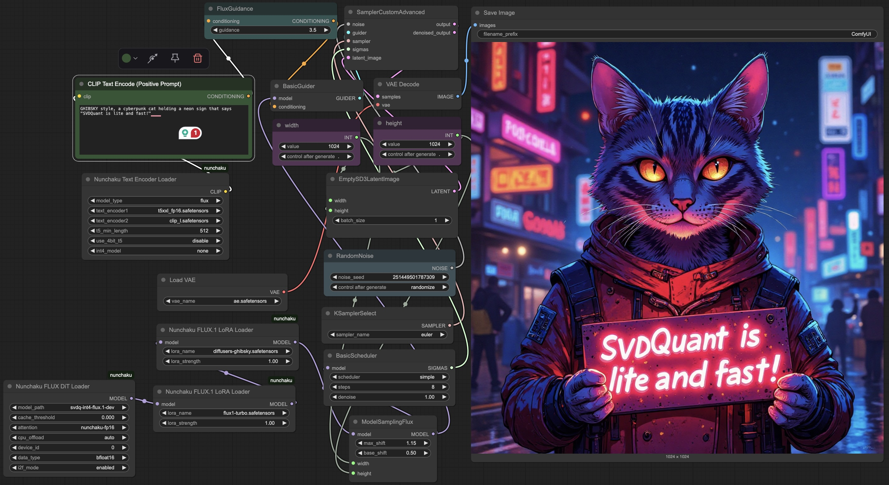

# SVDQuant ComfyUI Node


## Installation

Please first install `nunchaku` following the instructions in [README.md](https://github.com/mit-han-lab/nunchaku?tab=readme-ov-file#installation). Then just install `image_gen_aux` with 

```shell
pip install git+https://github.com/asomoza/image_gen_aux.git
```

### ComfyUI-CLI

```shell
pip install comfy-cli  # install the comfyui-cli
comfy node registry-install svdquant
```

### ComfyUI-Manager (Experimental)

1. Install [ComfyUI-Manager](https://github.com/ltdrdata/ComfyUI-Manager) with the following commands then restart ComfyUI:

   ```shell
   cd ComfyUI/custom_nodes
   git clone https://github.com/ltdrdata/ComfyUI-Manager comfyui-manager
   ```

2. Open the Manager, search `svdquant` in the Custom Nodes Manager and then install it.


### Manual Installation
1. Install dependencies needed to run custom ComfyUI nodes:

   ```shell
   pip install git+https://github.com/asomoza/image_gen_aux.git
   ```
2. Set up the dependencies for [ComfyUI](https://github.com/comfyanonymous/ComfyUI/tree/master) with the following commands:

   ```shell
   git clone https://github.com/comfyanonymous/ComfyUI.git
   cd ComfyUI
   pip install -r requirements.txt
   ```

3. Navigate to the root directory of ComfyUI and link (or copy) the [`nunchaku/comfyui`](./) folder to `custom_nodes/svdquant`. For example:

   ```shell
   # Clone repositories (skip if already cloned)
   git clone https://github.com/comfyanonymous/ComfyUI.git
   git clone https://github.com/mit-han-lab/nunchaku.git
   cd ComfyUI
   
   # Add SVDQuant nodes
   cd custom_nodes
   ln -s ../../nunchaku/comfyui svdquant
   ```

## Usage

1. **Set Up ComfyUI and SVDQuant**:

     * SVDQuant workflows can be found at [`workflows`](./workflows). You can place them in `user/default/workflows` in ComfyUI root directory to load them. For example:

       ```shell
       cd ComfyUI
       
       # Copy workflow configurations
       mkdir -p user/default/workflows
       cp ../nunchaku/comfyui/workflows/* user/default/workflows/
       ```

     * Install missing nodes (e.g., comfyui-inpainteasy) following [this tutorial](https://github.com/ltdrdata/ComfyUI-Manager?tab=readme-ov-file#support-of-missing-nodes-installation).

2. **Download Required Models**: Follow [this tutorial](https://comfyanonymous.github.io/ComfyUI_examples/flux/) and download the required models into the appropriate directories using the commands below:

   ```shell
   huggingface-cli download comfyanonymous/flux_text_encoders clip_l.safetensors --local-dir models/text_encoders
   huggingface-cli download comfyanonymous/flux_text_encoders t5xxl_fp16.safetensors --local-dir models/text_encoders
   huggingface-cli download black-forest-labs/FLUX.1-schnell ae.safetensors --local-dir models/vae
   ```

3. **Run ComfyUI**: From ComfyUI’s root directory, execute the following command to start the application:

   ```shell
   python main.py
   ```

4. **Select the SVDQuant Workflow**: Choose one of the SVDQuant workflows (workflows that start with `svdq-`) to get started. For the FLUX.1-Fill workflow, you can use the built-in MaskEditor tool to add mask on top of an image.

## SVDQuant Nodes

* **SVDQuant Flux DiT Loader**: A node for loading the FLUX diffusion model. 

  * `model_path`: Specifies the model location. If set to the folder starting with `mit-han-lab`, the model will be automatically downloaded from our Hugging Face repository. Alternatively, you can manually download the model directory by running the following command example:

    ```shell
    huggingface-cli download mit-han-lab/svdq-int4-flux.1-dev --local-dir models/diffusion_models/svdq-int4-flux.1-dev
    ```

     After downloading, specify the corresponding folder name as the `model_path`.

  * `cpu_offload`: Enables CPU offloading for the transformer model. While this may reduce GPU memory usage, it can slow down inference. Memory usage will be further optimized in node v0.1.6.

  * `device_id`: Indicates the GPU ID for running the model.

* **SVDQuant FLUX LoRA Loader**: A node for loading LoRA modules for SVDQuant FLUX models.

  * Place your LoRA checkpoints in the `models/loras` directory. These will appear as selectable options under `lora_name`. Meanwhile, the [example Ghibsky LoRA](https://huggingface.co/aleksa-codes/flux-ghibsky-illustration) is included and will automatically download from our Hugging Face repository when used.
  * `lora_format` specifies the LoRA format. Supported formats include:
* `auto`: Automatically detects the appropriate LoRA format.
    * `diffusers` (e.g., [aleksa-codes/flux-ghibsky-illustration](https://huggingface.co/aleksa-codes/flux-ghibsky-illustration))
    * `comfyui` (e.g., [Shakker-Labs/FLUX.1-dev-LoRA-Children-Simple-Sketch](https://huggingface.co/Shakker-Labs/FLUX.1-dev-LoRA-Children-Simple-Sketch))
    * `xlab` (e.g., [XLabs-AI/flux-RealismLora](https://huggingface.co/XLabs-AI/flux-RealismLora))
    * `svdquant` (e.g., [mit-han-lab/svdquant-lora-collection](https://huggingface.co/mit-han-lab/svdquant-lora-collection)).

  * `base_model_name` specifies the path to the quantized base model. If `lora_format` is already set to `svdquant`, this option has no use. You can set it to the same value as `model_path` in the above **SVDQuant Flux DiT Loader**.
  * **Note**: Currently, **only one LoRA** can be loaded at a time.

* **SVDQuant Text Encoder Loader**: A node for loading the text encoders.

  * For FLUX, use the following files:

    - `text_encoder1`: `t5xxl_fp16.safetensors`
    - `text_encoder2`: `clip_l.safetensors`

  * `t5_min_length`: Sets the minimum sequence length for T5 text embeddings. The default in `DualCLIPLoader` is hardcoded to 256, but for better image quality in SVDQuant, use 512 here.

  * `t5_precision`: Specifies the precision of the T5 text encoder. Choose `INT4` to use the INT4 text encoder, which reduces GPU memory usage by approximately 15GB. Please install [`deepcompressor`](https://github.com/mit-han-lab/deepcompressor) when using it:

    ```shell
    git clone https://github.com/mit-han-lab/deepcompressor
    cd deepcompressor
    pip install poetry
    poetry install
    ```
  
  
    * `int4_model`: Specifies the INT4 model location. This option is only used when `t5_precision` is set to `INT4`. By default, the path is `mit-han-lab/svdq-flux.1-t5`, and the model will automatically download from our Hugging Face repository. Alternatively, you can manually download the model directory by running the following command:
  
      ```shell
      huggingface-cli download mit-han-lab/svdq-flux.1-t5 --local-dir models/text_encoders/svdq-flux.1-t5
      ```
  
       After downloading, specify the corresponding folder name as the `int4_model`.
  


* **FLUX.1 Depth Preprocessor**: A node for loading the depth estimation model and output the depth map. `model_path` specifies the model location. If set to [`LiheYoung/depth-anything-large-hf`](https://huggingface.co/LiheYoung/depth-anything-large-hf), the model will be automatically downloaded from the Hugging Face repository. Alternatively, you can manually download the repository at `models/checkpoints` by running the following command example:

  ```shell
  huggingface-cli download LiheYoung/depth-anything-large-hf --local-dir models/checkpoints/depth-anything-large-hf
  ```

  

